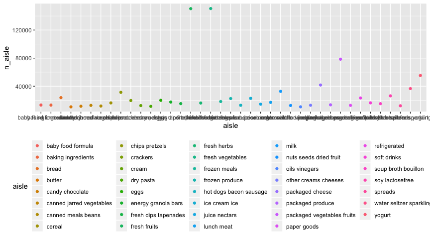

p8105\_hw3\_ql2370
================
QiLu
10/12/2019

``` r
library(tidyverse)
```

    ## ── Attaching packages ───────────────────────────────────────────────── tidyverse 1.2.1 ──

    ## ✔ ggplot2 3.2.1     ✔ purrr   0.3.2
    ## ✔ tibble  2.1.3     ✔ dplyr   0.8.3
    ## ✔ tidyr   1.0.0     ✔ stringr 1.4.0
    ## ✔ readr   1.3.1     ✔ forcats 0.4.0

    ## ── Conflicts ──────────────────────────────────────────────────── tidyverse_conflicts() ──
    ## ✖ dplyr::filter() masks stats::filter()
    ## ✖ dplyr::lag()    masks stats::lag()

## Problem 1

``` r
library(p8105.datasets)
data("instacart")
janitor::clean_names(instacart)
```

    ## # A tibble: 1,384,617 x 15
    ##    order_id product_id add_to_cart_ord… reordered user_id eval_set
    ##       <int>      <int>            <int>     <int>   <int> <chr>   
    ##  1        1      49302                1         1  112108 train   
    ##  2        1      11109                2         1  112108 train   
    ##  3        1      10246                3         0  112108 train   
    ##  4        1      49683                4         0  112108 train   
    ##  5        1      43633                5         1  112108 train   
    ##  6        1      13176                6         0  112108 train   
    ##  7        1      47209                7         0  112108 train   
    ##  8        1      22035                8         1  112108 train   
    ##  9       36      39612                1         0   79431 train   
    ## 10       36      19660                2         1   79431 train   
    ## # … with 1,384,607 more rows, and 9 more variables: order_number <int>,
    ## #   order_dow <int>, order_hour_of_day <int>,
    ## #   days_since_prior_order <int>, product_name <chr>, aisle_id <int>,
    ## #   department_id <int>, aisle <chr>, department <chr>

Instacart is an online grocery service that allows you to shop online
from local stores. In New York City, partner stores include Whole Foods,
Fairway, and The Food Emporium. Instacart offers same-day delivery, and
items that users purchase are delivered within 2 hours.

This dataset describes the order history of “The Instacart Online
Grocery Shopping 2017”, which has 1384617 objects and 15 variables
including order id, product id, user id, reordered, days since prior
order, department id, etc.

For example, the order with order id 1 added totally 8 items which 4 of
them were reordered, and this order was placed on Thursday 10 am. The
same user placed the prior order 9 days ago. Also, the detailed products
information was included in this dataset.

``` r
aisle_rank = instacart %>%
  count(aisle, name = "n_aisle") %>% 
  mutate(rank = min_rank(desc(n_aisle)))

aisle_max = aisle_rank %>% 
  filter(rank(desc(n_aisle)) == 1)

aisle_size = count(aisle_rank)
aisle_size
```

    ## # A tibble: 1 x 1
    ##       n
    ##   <int>
    ## 1   134

``` r
aisle_max
```

    ## # A tibble: 1 x 3
    ##   aisle            n_aisle  rank
    ##   <chr>              <int> <int>
    ## 1 fresh vegetables  150609     1

1)  There were 134 aisles, and the most itmes ordered from “fresh
    vegetables”.

<!-- end list -->

``` r
aisle_plot = aisle_rank %>% 
  filter(n_aisle > 10000)

ggplot(aisle_plot, aes(x= aisle, y = n_aisle, color = aisle)) + 
  geom_point() +
   theme(legend.position = "bottom")
```

<!-- -->

2)  This is the plot that shows the number of items ordered in each
    aisle, limiting this to aisles with more than 10000 items ordered.

<!-- end list -->

``` r
baking_data = instacart %>% 
  filter(aisle == "baking ingredients" | aisle == "dog food care" | aisle == "packaged vegetables fruits") %>% 
  group_by(aisle, product_name) %>% 
  summarize(count = n()) %>% 
  mutate(rank = rank(desc(count))) %>% 
  filter(rank <= 3)

baking_data
```

    ## # A tibble: 9 x 4
    ## # Groups:   aisle [3]
    ##   aisle                  product_name                           count  rank
    ##   <chr>                  <chr>                                  <int> <dbl>
    ## 1 baking ingredients     Cane Sugar                               336     3
    ## 2 baking ingredients     Light Brown Sugar                        499     1
    ## 3 baking ingredients     Pure Baking Soda                         387     2
    ## 4 dog food care          Organix Chicken & Brown Rice Recipe       28     2
    ## 5 dog food care          Small Dog Biscuits                        26     3
    ## 6 dog food care          Snack Sticks Chicken & Rice Recipe Do…    30     1
    ## 7 packaged vegetables f… Organic Baby Spinach                    9784     1
    ## 8 packaged vegetables f… Organic Blueberries                     4966     3
    ## 9 packaged vegetables f… Organic Raspberries                     5546     2

3)  This is the table showing the three most popular items in each of
    the aisles “baking ingredients”, “dog food care”, and “packaged
    vegetables fruits”. Include the number of times each item is ordered
    in your table.

Make a table showing the mean hour of the day at which Pink Lady Apples
and Coffee Ice Cream are ordered on each day of the week; format this
table for human readers (i.e. produce a 2 x 7 table)

## Including Plots

You can also embed plots, for example:

<!-- -->

Note that the `echo = FALSE` parameter was added to the code chunk to
prevent printing of the R code that generated the plot.
